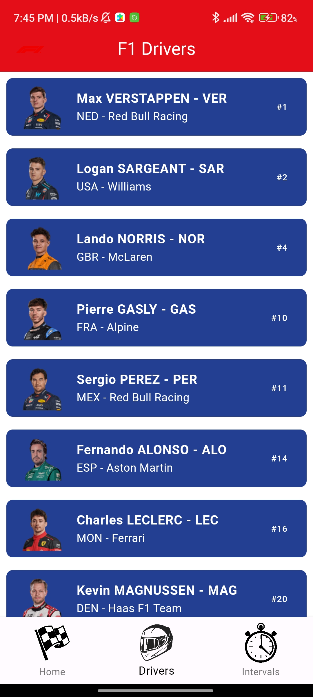

  <h1> F1 4K</h1>

  

   
  This application was created as a personal project to enhance my learning in Flutter. Additionally, I focused on achieving greater accessibility to F1 information, including upcoming races, race types, drivers, and a feature available only during the race to access time intervals, all thanks to the API provided by: https://openf1.org/

## Features
- The application is simple and clear for everyone.
- You can find out when and what type of race, practice, or qualifying is going to take place.
- You can get to know the drivers who make up the Formula One grid.
- You can check real-time interval timings, provided there is a Grand Prix currently running.

## Preview

  
 
  
 
  
- If there is no race currently ongoing, this is the message that should appear:
  

## Technologies

  
  

## Api
| Api | Link |
| ------ | ------ |
| Formula One API | <a href = "https://openf1.org/"> https://openf1.org/ </a>| 

